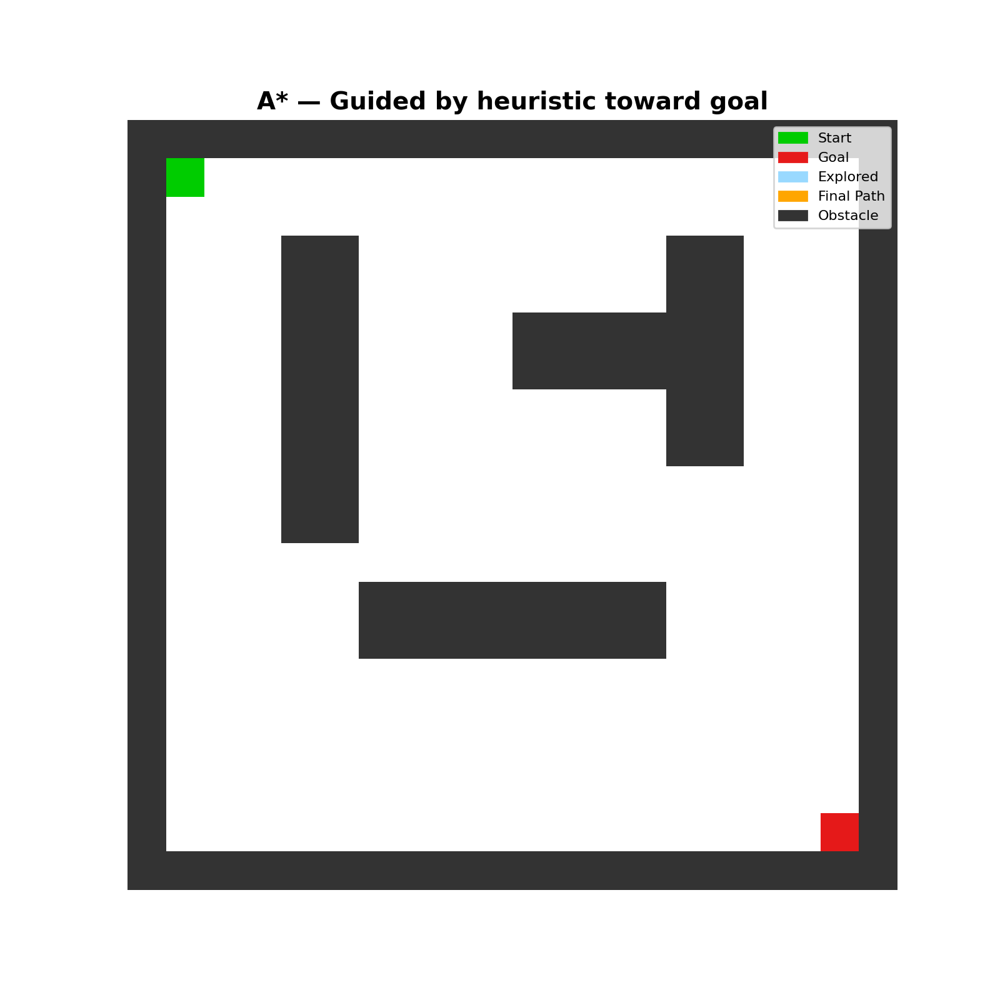

# Mobile Robot Path Planning

Comparison of **Dijkstra** and **A\*** path planning algorithms
on a 2D occupancy grid, with MuJoCo physics simulation.

## Algorithms
| | Dijkstra | A* |
|---|---|---|
| Strategy | Explores all directions equally | Guided by heuristic toward goal |
| Optimal? | ✓ Always finds shortest path | ✓ Always finds shortest path |
| Speed | Slower (explores more cells) | Faster (explores fewer cells) |

## Results

## How to run
pip install mujoco numpy matplotlib
python3 main.py

## Project structure
path_planning/
├── map.py         Grid map with obstacles
├── dijkstra.py    Dijkstra algorithm
├── astar.py       A* algorithm  
├── visualizer.py  Matplotlib animation
└── simulation.py  MuJoCo robot execution
